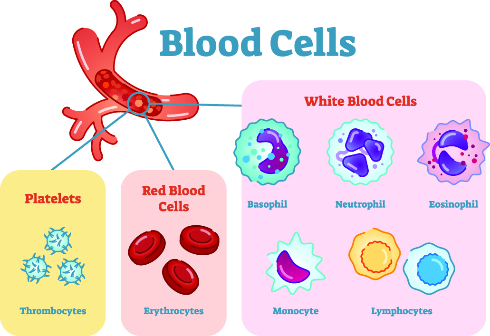
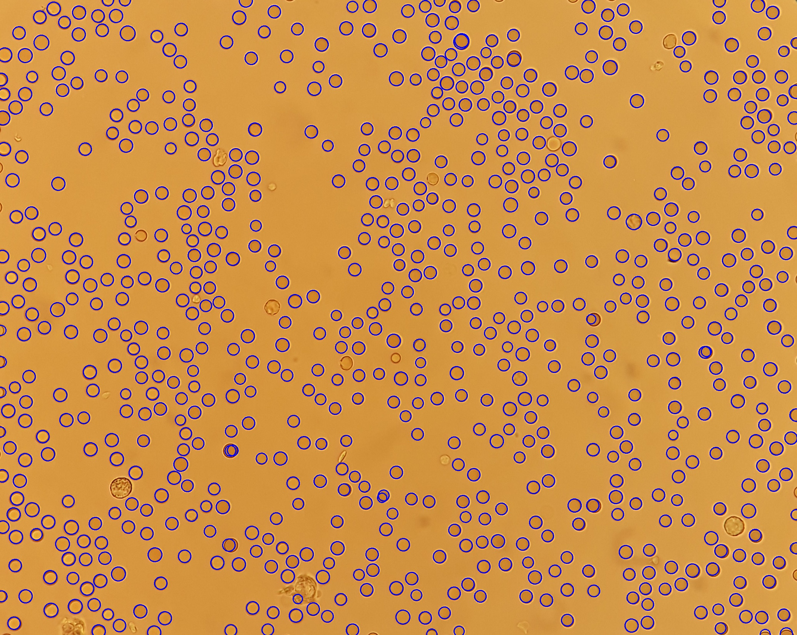
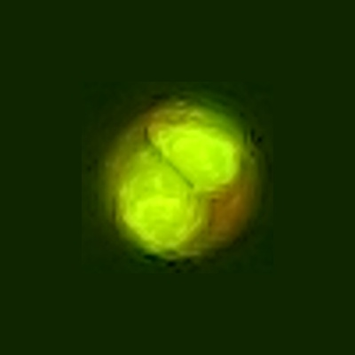
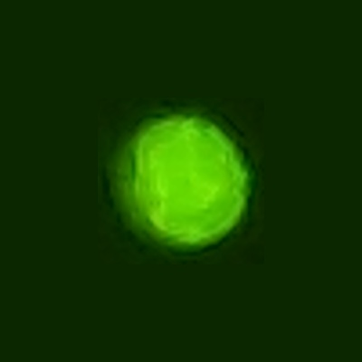
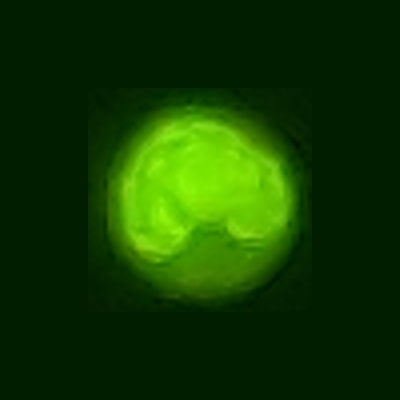
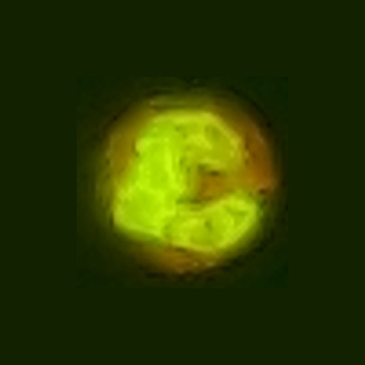
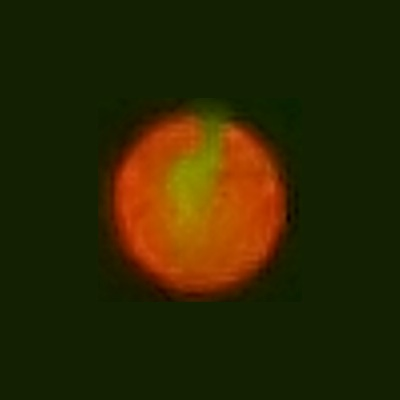

# NABZ GROUP
## CELL COUNTER

## In this project after using a novel technique for imaging of cells in blood what is a microfluidic channel we can take a picture using a camera and a microscope then by image processing techniques we can count and classify these cells to detect a special desease . 

1-for finding the python codes of this project for red blood cell : RBC.ipynb 

2-for finding the python codes of this project for white blood cell segmentation : WBC_segmentation.ipynb 

2-for finding the python codes of this project for white blood cell classification : WBC_classification.ipynb 

####  ***All of this dataset has been taken by our lab microscope*** 

### segmentation and classification and counting the cells in blood :

   1-red blood cell : 
                      
                      1- counting the numbers of RBC     RESULT : 99.25% in counting 
   
                      2- finding the radius of RBC       RESULT : mean = 99%  and variance = 90%  
                      
                      3- dataset : 322 images that averagely any image has 1000 RBC
   
   
   2-white blood cell : 
   
                      1- counting the numbers of WBC     RESULT : 100% in counting 
   
                      2- classification of WBC       RESULT : 92% in classification  
                      
                      3- dataset : 401 images that averagely any image has 3 WBC
   
   3-platelet  :  1- counting the numbers of PLT   2- finding the radius of PLT 
                             
   
 

### blood cells

                      

for medicl application , blood cells have a huge information about the diseases . so we can after taking a picture of these cells and processing and counting how many of these cells exist in the blood then we can detect a special desease 

### red blood cell

### red blood cell after detection

### esotrophil

 
### lamphocyte
 

 
### monocyte
 

### neutrophile
 

### basophill
 

