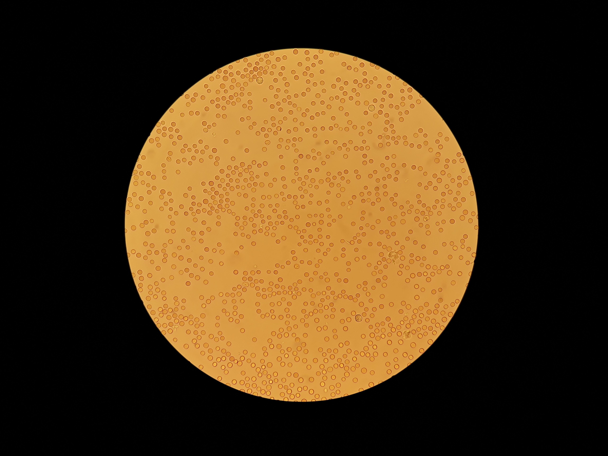

# CELL COUNTER
## Deep learning for wbc classification   and  image processing for rbc counting

### HOW TO USE IT :

   1-install : 
                      
         git clone https://github.com/saeed5959/CellCounter
         pip install -r requirements.txt
                      
   2-RBC :
   
         python3 main.py   --mode rbc_count   --img_path ./test_data/RBC/1.jpg
         
   2-WBC classify infer :
   
         python3 main.py   --mode wbc_classify_infer   --img_path ./test_data/WBC/classify/basophil.jpg  --model_path ./model.pth
         
   2-WBC classify train :
   
         python3 main.py --mode wbc_classify_train --dataset_file ./dataset_file.txt  --model_path ./model.pth
         
   2-WBC segmentation :
   
         python3 main.py --mode wbc_segment --img_path ./test_data/WBC/segment/main_image.jpg
                      
                      
                      
                      
### segmentation and classification and counting the cells in blood :

   1-red blood cell : 
                      
                      1- counting the numbers of RBC     RESULT : 99.25% in counting 
   
                      2- finding the radius of RBC       RESULT : mean = 99%  and variance = 90%  
                      
                      3- dataset : 322 images that averagely any image has 1000 RBC
   
   
   2-white blood cell : 
   
                      1- counting the numbers of WBC     RESULT : 100% in counting 
   
                      2- classification of WBC       RESULT : 92% in classification  
                      
                      3- dataset : 401 images that averagely any image has 3 WBC
  
                             

### blood cells

                      

for medicl application , blood cells have a huge information about the diseases . so we can after taking a picture of these cells and processing and counting how many of these cells exist in the blood then we can detect a special desease 

### red blood cell

### red blood cell after detection

### esotrophil

 
### lamphocyte
 

 
### monocyte
 

### neutrophile
 

### basophill
 

